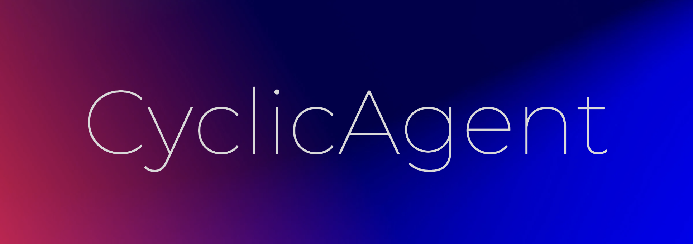

<div align= "center">
    
    <h4>CyclicAgent is a framework designed for creating  LLM powered, fully-autonomous AI.
</h4>
</div>


f
Install with pip:
```shell
  pip install cyclic-agent
```
## How Does CyclicAgent Work?
With Cyclic Agent, an agent is abstracted as a finite state machine (FSM) using the state design pattern. In each state, the agent infers the next state based on the internal state attributes (memory, meta prompts etc.) as well as external signals, and interact with the outside environment along the process. 

All states implement a state transition function, which returns another state. This allows for chaining the transition operation indefinitely, thus making the Agent 'Cyclic'.

### Simple Example
```python
from __future__ import annotations
import os
import time
import cohere
from cyclic_agent import State, CyclicExecutor

co = cohere.Client(os.environ.get("COHERE_API_KEY"))

class AskQuestion(State[None]):
    def next(self, signal: None = None) -> AnswerQuestion:
        response = co.chat(message="Ask a question", temperature=1)
        print(response.text)
        return AnswerQuestion(question=response.text)

class AnswerQuestion(State[None]):
    question: str

    def next(self, signal: None = None) -> AskQuestion:
        answer = co.chat(message=self.question)
        print(answer)
        return AskQuestion()

if __name__ == "__main__":
    initial_state = AskQuestion()
    executor = CyclicExecutor(5)
    executor.start(initial_state)
    time.sleep(20)
```
> Note: `from __future__ import annotations` is needed for forward references

In the above example, we create two states: `AskQuestion`, `AnswerQuestion` that each transitions to the other. The state machine prints question-answer pairs when ran.